# UAS_PemrogramanWeb1

# E-Perpus (Sistem Informasi Perpustakaan Digital)

> **Repository ini disusun untuk memenuhi Ujian Akhir Semester (UAS) Mata Kuliah Pemrograman Web.**

Aplikasi **E-Perpus** adalah sistem informasi manajemen perpustakaan berbasis web yang dibangun menggunakan **PHP Native** dengan konsep arsitektur **MVC (Model-View-Controller)**. Aplikasi ini dirancang untuk mempermudah proses administrasi perpustakaan, mulai dari pengelolaan data buku, keanggotaan, hingga transaksi peminjaman dan pengembalian buku secara digital.

---

## 👨‍🎓 Identitas Mahasiswa

**Nama : Sayyid Sulthan Abyan**

**NIM : 312410496**

**Kelas : TI.24.A.5**

---

## 🌐 Link Demo

* **🌍 Live Demo:** [http://digital-library.rf.gd](http://digital-library.rf.gd)

akun:
* Username:(user1) Password:(12345)
* Username:(user2) Password:(54321)

---

## 🛠️ Teknologi yang Digunakan (Tech Stack)

Aplikasi ini dibangun tanpa menggunakan Framework PHP (seperti Laravel/CI), melainkan membangun struktur MVC sendiri dari nol (*From Scratch*).

* **Backend Language:** PHP 8.0+ (OOP & MVC Pattern)
* **Database:** MySQL
* **Frontend Framework:** Bootstrap 5 (Responsive UI)
* **Styling:** CSS3 & Bootstrap Icons
* **Server:** Apache (XAMPP Localhost / InfinityFree Hosting)
* **Other Tools:** Git, Visual Studio Code

---

## 📚 Fitur & Fungsionalitas

Sistem ini memiliki dua aktor utama: **Admin (Pustakawan)** dan **User (Anggota/Mahasiswa)**.

### 1. Fitur Umum
* **Routing URL Cantik:** Menggunakan `.htaccess` untuk menyembunyikan ekstensi `.php` (URL terlihat bersih).
    ```
    <IfModule mod_rewrite.c>
        Options -Multiviews
        RewriteEngine On
    
        RewriteCond %{REQUEST_FILENAME} !-d
        RewriteCond %{REQUEST_FILENAME} !-f
        
        RewriteRule ^(.*)$ index.php?url=$1 [QSA,L]
    </IfModule>
      ```

* **Security:** Proteksi SQL Injection (PDO Binding) dan XSS Prevention.
* **Alert System:** Notifikasi *Flasher* untuk memberi feedback sukses/gagal aksi.
  `app/core/Flasher.php`
  ```php
  <?php 
        class Flasher {
            public static function setFlash($pesan, $aksi, $tipe)
            {
                $_SESSION['flash'] = [
                    'pesan' => $pesan,
                    'aksi'  => $aksi,
                    'tipe'  => $tipe
                ];
            }
    
        public static function flash()
        {
            if( isset($_SESSION['flash']) ) {
                echo '<div class="alert alert-' . $_SESSION['flash']['tipe'] . ' alert-dismissible fade show" role="alert">
                        Data <strong>' . $_SESSION['flash']['pesan'] . '</strong> ' . $_SESSION['flash']['aksi'] . '
                        <button type="button" class="btn-close" data-bs-dismiss="alert" aria-label="Close"></button>
                      </div>';
                unset($_SESSION['flash']);
            }
        }
    }

### 2. Fitur Admin
* **Dashboard Statistik:** Melihat ringkasan jumlah buku, anggota, dan transaksi aktif.
* **Manajemen Buku (CRUD):** Menambah, mengedit, menghapus, dan mencari buku. Termasuk upload gambar sampul.
* **Transaksi Peminjaman:** Mencatat peminjaman buku oleh anggota.
* **Transaksi Pengembalian:** Memproses pengembalian buku, hitung denda otomatis (jika ada), dan update stok buku.
* **Manajemen Anggota:** Mengelola data pengguna.

### 3. Fitur User (Anggota)
* **Katalog Buku:** Melihat daftar buku yang tersedia beserta detail dan status stok.
* **Pencarian:** Mencari buku berdasarkan judul atau pengarang.
* **Profil Saya:** Halaman khusus untuk melihat biodata diri dan status keanggotaan.

---

## 📸 Dokumentasi & Screenshot Aplikasi

Berikut adalah tangkapan layar dari alur penggunaan aplikasi E-Perpus.

### A. Halaman Public
halaman yang bisa di akses semua orang tanpa harus login

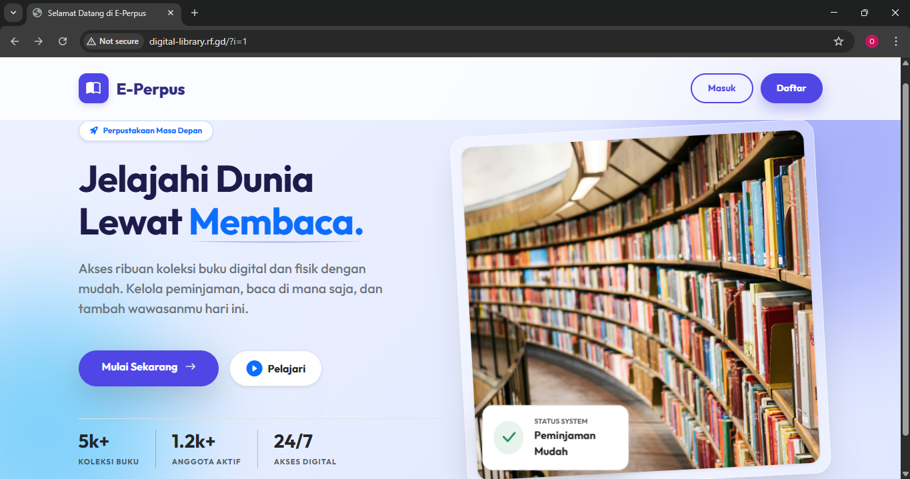

---

### B. Autentikasi (Login)
Halaman masuk yang dilengkapi validasi untuk membedakan hak akses Admin dan User.

**Login sebagai admin:**
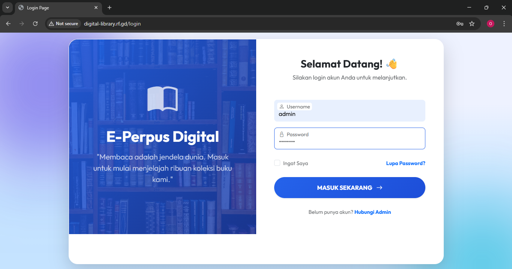

**Login sebagai user:**
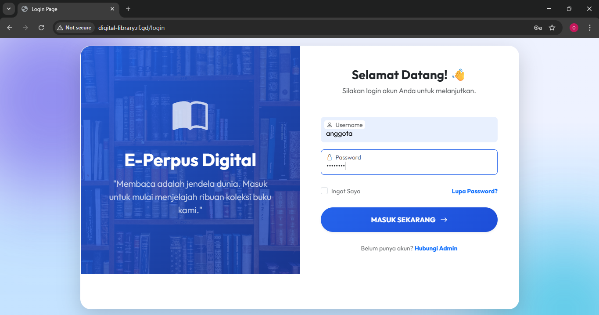

*Keterangan: Halaman Login dengan validasi username & password.*

---

### B. Hak Akses: ADMIN
Berikut adalah tampilan dan fitur yang hanya bisa diakses oleh Pustakawan.

#### 1. Dashboard Admin
Halaman utama setelah login, menampilkan ringkasan data perpustakaan.

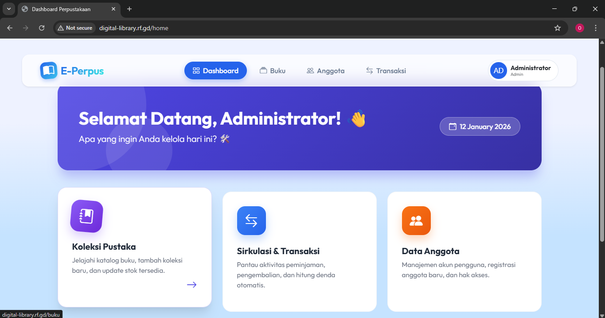

#### 2. Manajemen Data Buku (CRUD)
Admin dapat melihat daftar buku, menambah buku baru (upload cover), serta mengedit atau menghapus data.

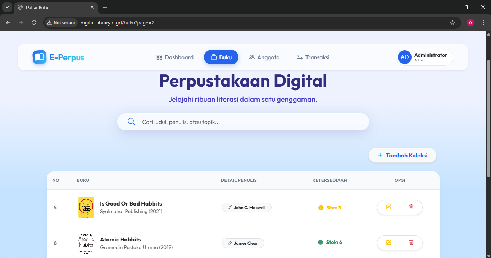
*Keterangan: Tampilan daftar buku dengan fitur pencarian dan tombol aksi.*

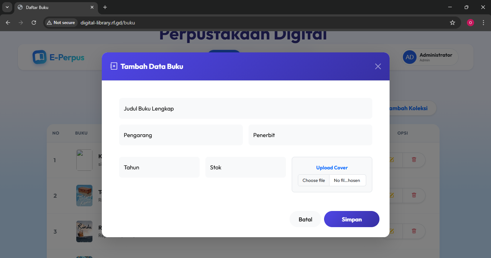
*Keterangan: Modal/Form untuk input data buku baru.*

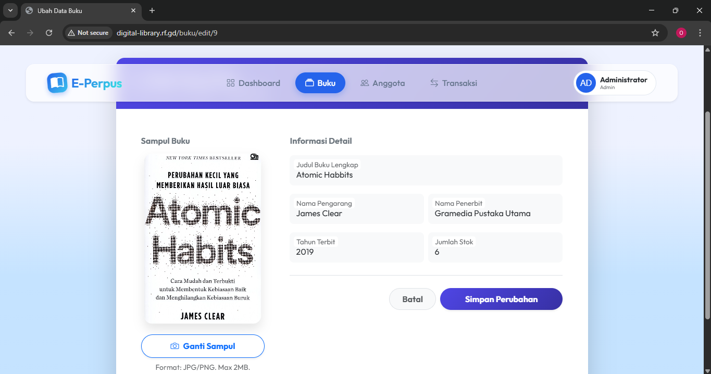
*Keterangan: Modal/Form untuk edit data buku.*

#### 3. Transaksi Peminjaman
Proses saat Admin mencatat peminjaman buku untuk anggota, Stok buku akan berkurang otomatis. Dan mencatat pengembalian dan menghitung denda, stok buku akan bertambah kembali.


#### 4. Anggota
Melihat, menambahkan, dan mengedit daftar anggota.

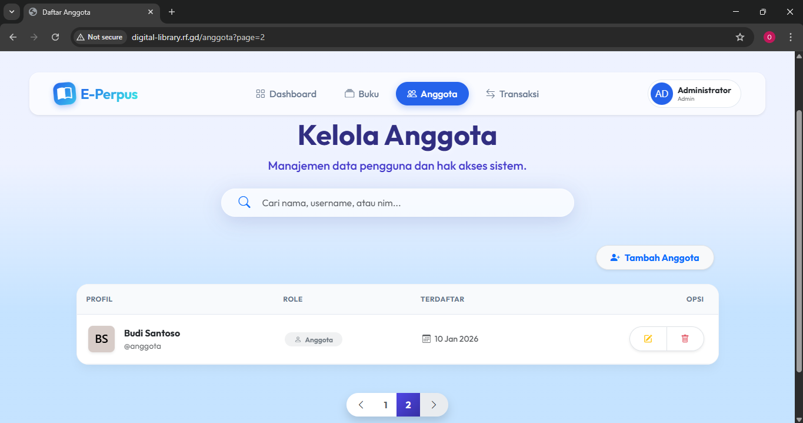
*Keterangan: Tampilan daftar anggota dengan fitur pencarian dan tombol aksi.*

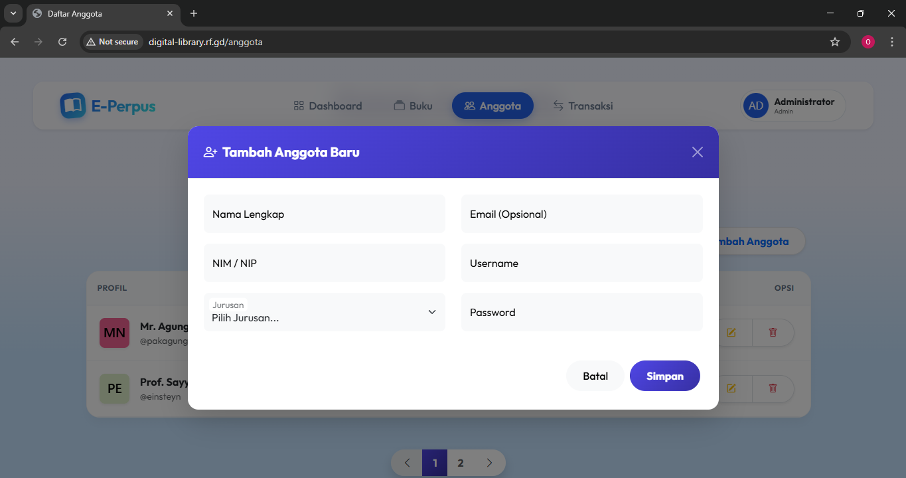
*Keterangan: Modal/Form untuk input data anggota baru.*

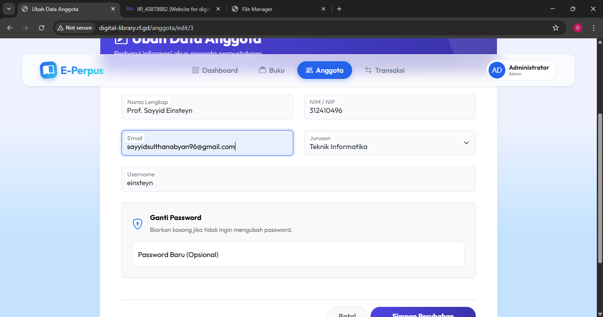
*Keterangan: Modal/Form untuk edit data anggota.*

---

### C. Hak Akses: USER (ANGGOTA)
Berikut adalah tampilan dari sisi User/Anggota.

#### 1. Dashboard User
Halaman depan yang menampilkan menu-menu yang bisa diakses oleh user.

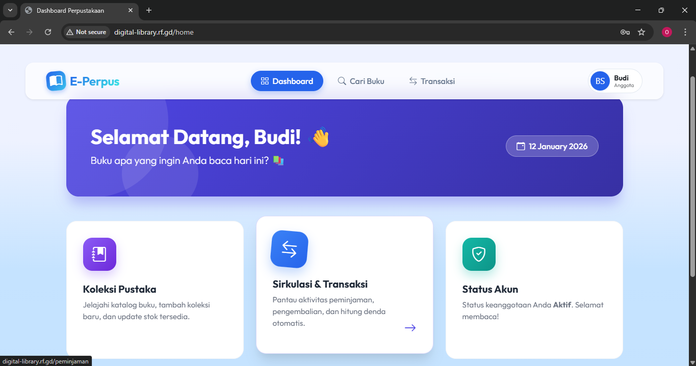

#### 2. Melihat Daftar Buku
Halaman katalog buku yang menampilkan informasi daftar buku secara estetik, dan User juga bisa meminjam buku.

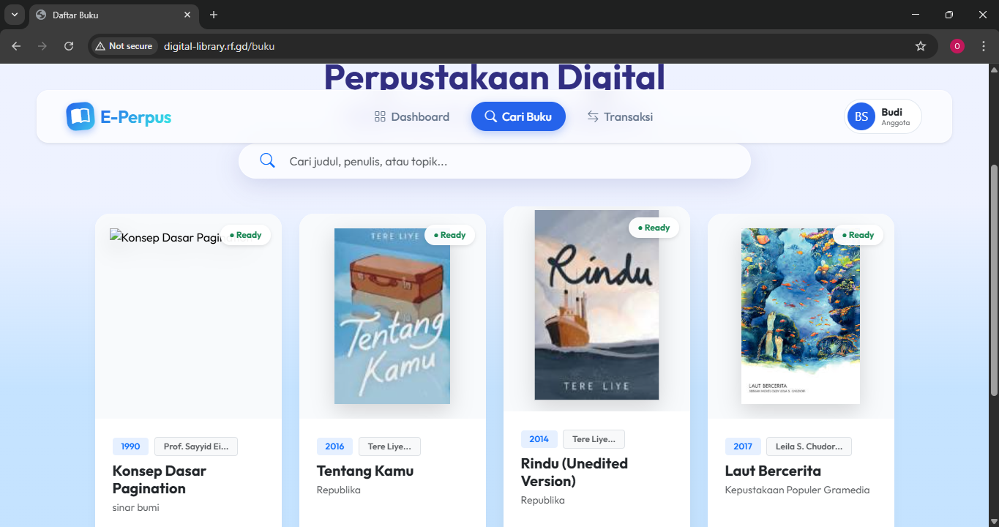

### 3. Melihat History Transaksi
Halaman History yang menampilkan riwayat traksaksi.

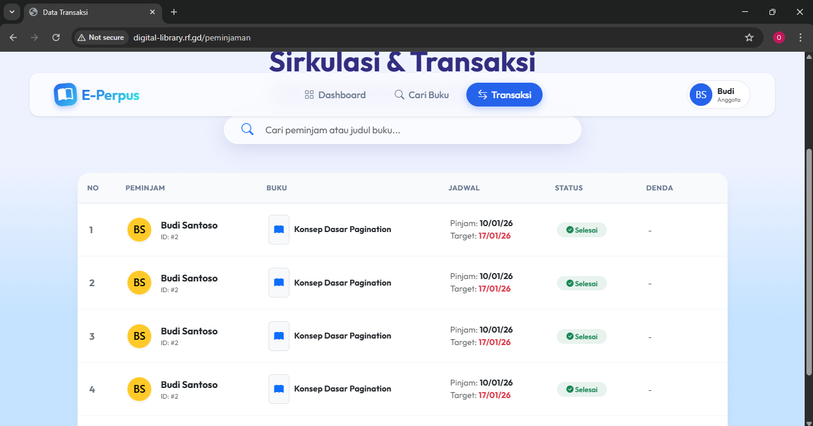

---

### Profile
Halaman informasi profile 

**Profile Admin:**
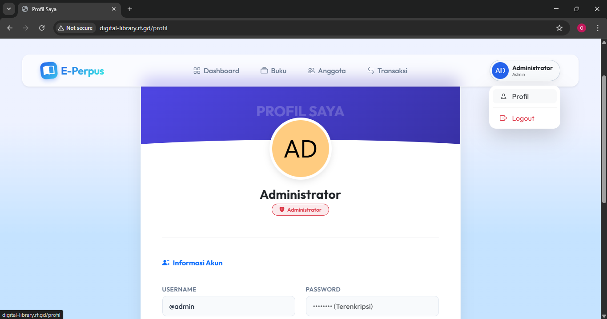

**Profile User/Anggota:**
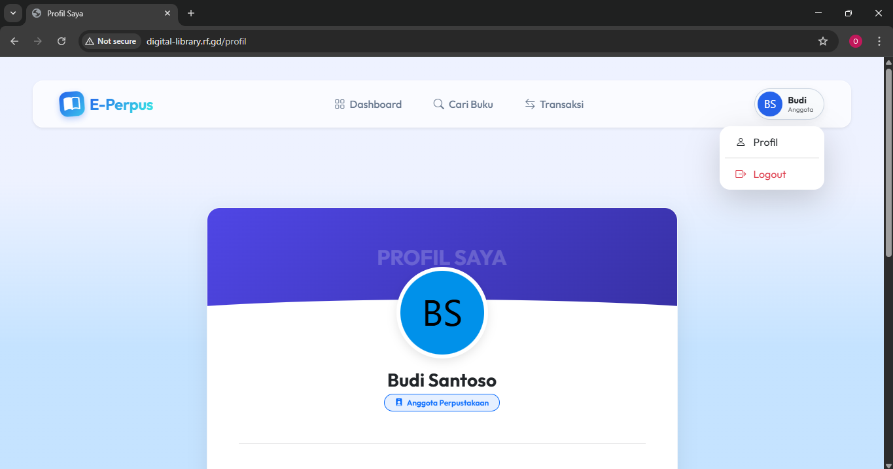

---
**Universitas Pelita Bangsa - 2025**
